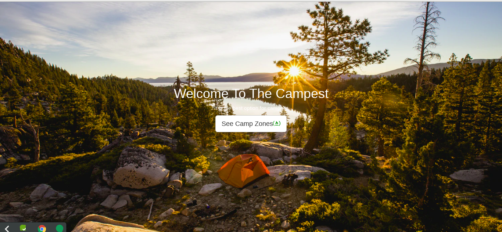
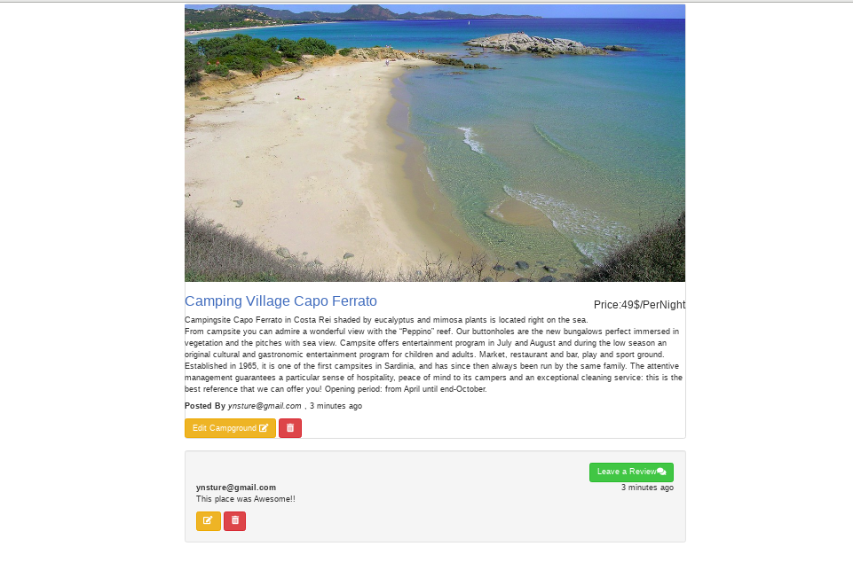
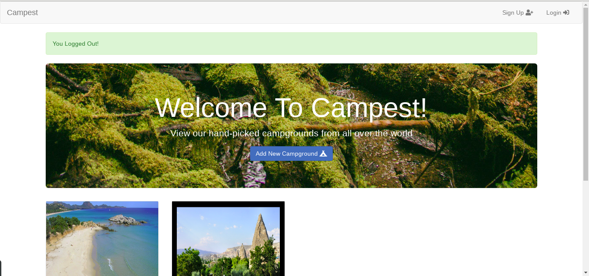
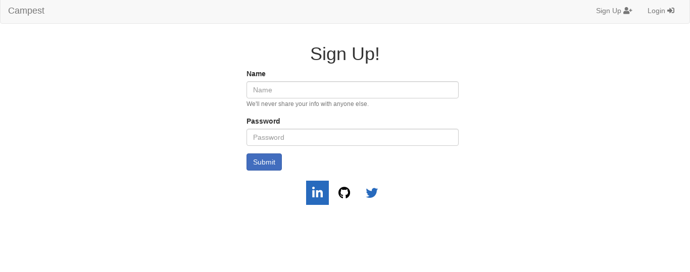

# Welcome To Campest!

## This project developed for the purpose of shoving camp zones.

### Technologies :

1. Node.js and Express for back end.
2. Ejs
3. Vanilla Js and some Jquery for animations .
4. MongoDB for Database.

### Functions :

- Sign In ,Sign Up (Passport.js)
- Authorization
- Authentication
- Flash messages for both erors and successful acts.
- Comments (Multi relations for users and comments)
- Likes
- Restful Routes and All CRUD operations works successfully.

## ScreenShots :

   
   
   
    

